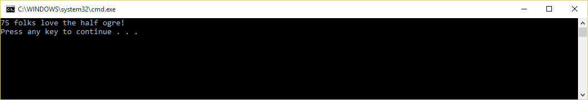

# Strong Namer

Most applications in .NET [do not need to be strong named][1].  Strong names can
also introduce pain because they end up requiring binding redirects.  Because of
this, many OSS libraries do not strong name their assemblies.

[1]: https://github.com/dotnet/corefx/blob/c02d33b18398199f6acc17d375dab154e9a1df66/Documentation/project-docs/strong-name-signing.md#faq

Strong named assemblies that reference assemblies that aren't strong named are
rejected by the .NET Framework (desktop app only restriction).
So if for whatever reason you actually do need to strong name your project, you
couldn't easily consume open source packages.

Strong Namer is a NuGet package which aims to change this.  Simply install the
[StrongNamer](https://www.nuget.org/packages/strongnamer) NuGet package, and
it will transparently and automatically sign the assemblies you reference as
part of the build process.

# Demo

Here's how to try Strong Namer out for yourself:

- Create a new Console application
- Add a strong name to the application
  - *Go to the Signing tab of the project properties*
  - *Check "Sign the assembly"*
  - *In the key file dropdown, choose &lt;New...&gt;*
  - *Choose a key file name (ie "key.snk"), uncheck the password option,
     and click OK*
- Add a reference to the [Octokit](https://www.nuget.org/packages/octokit)
  NuGet package
- Replace Program class with the following code:

``` C#
using Octokit;
using System;
using System.Collections.Generic;
using System.Linq;
using System.Text;
using System.Threading.Tasks;

class Program
{
    static void Main(string[] args)
    {
        MainAsyncWithErrorHandling().Wait();
    }

    static async Task MainAsyncWithErrorHandling()
    {
        try
        {
            await MainAsync();
        }
        catch (Exception ex)
        {
            Console.WriteLine(ex.ToString());
        }
    }

    static async Task MainAsync()
    {
        var github = new GitHubClient(new ProductHeaderValue("MyAmazingApp"));
        var user = await github.User.Get("half-ogre");
        Console.WriteLine(user.Followers + " folks love the half ogre!");
    }
}
```
- Start without debugging (CTRL+F5)

![System.IO.FileLoadException: Could not load file or assembly 'Octokit, Version=0.16.0.0, Culture=neutral, PublicKeyToken=null' or one of its dependencies. A strongly-named assembly is required. (Exception from HRESULT: 0x80131044)
File name: 'Octokit, Version=0.16.0.0, Culture=neutral, PublicKeyToken=null'
   at Program.MainAsync()
   at Program.<MainAsyncWithErrorHandling>d__1.MoveNext() in C:\Users\daplaist\Documents\Visual Studio 2015\Projects\ConsoleApplication13\ConsoleApplication13\Program.cs:line 19](images/StrongNameSadPanda.png)
- :disappointed:
- Add a reference to the [StrongNamer]
  NuGet package
- Start without debugging (CTRL+F5)


- :sparkles: :fireworks: :smile: :fireworks: :sparkles:

# How does it work?

The NuGet package includes an MSBuild targets file and task which hook into the
build process and add a strong name to any references which aren't strong named
just before they are passed to the compiler.

The task uses Mono.Cecil to do this.  Credit goes to [Nivot.StrongNaming](https://github.com/oising/strongnaming) for showing me how
to do this.

# Options

You can conditionally disable automated signing of unsigned packages by setting the "DisableStrongNamer" property to "true".  This is particularly useful if you have a custom build configuration for your application (e.g., you only wish for unsigned packages to be autosigned in specific environments).

``.csproj`` Example:
``` xml 
<PropertyGroup>
...
<DisableStrongNamer>True</DisableStrongNamer>
</PropertyGroup>
```  

# Frequently Asked Questions

### [Q] I have many projects.  Which ones should I add StrongNamer to?

You should add [StrongNamer] to any project that meets both of the following conditions: 
1. **Signed** project
2. **Directly** consume an unsigned package.

#### Important

You'll need to modify the StrongNamer reference so consumer projects (even Tests projects) will run the [StrongNamer] magic when they run.  
Example:
``` xml
    <!--The PrivateAssets must not be removed. You can use anything but all/build-->
    <PackageReference Include="StrongNamer" Version="0.2.5" PrivateAssets="none"/>
```

By default, the ``PrivateAssets`` value includes ``build``, which cause the [StrongNamer] magic to not propogate to dependent projects.  
More on PrivateAssets [here.](https://docs.microsoft.com/en-us/nuget/consume-packages/package-references-in-project-files#controlling-dependency-assets)


### [Q] I would like to release my project as a NuGet package. Should I do something special?

If you are manually editing you ``nuspec`` file, make sure to add [StrongNamer] dependency like this:
``` xml
<dependency id="StrongNamer" version="0.2.5" />
```


If you are using ``dotnet pack`` or ``MSBuild -t:pack`` to create your package (pipeline or CLI), you will need to change the ``PrivateAssets`` of the [StrongNamer] reference - Please read the **Important** section of the previous question.  

This will eventually add a dependency to your .nuspec file like this:
``` xml
<dependency id="StrongNamer" version="0.2.5" include="All" />
```

``include="All"`` is equivalent to omitting it entirely (like in the manual ``nuspec`` method).  

**Now dependent projects will run your NuGet successfully!**


[StrongNamer]: https://www.nuget.org/packages/strongnamer